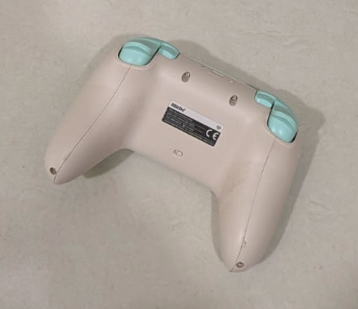

# Haptic Drive

A Python/Tkinter GUI that turns WASD keys into raw XInput rumble commands for an
**8BitDo Ultimate 2C** (connected via its 2.4GHz dongle), making the controller
physically creep, turn, and drive itself across a hard floor using only its two
haptic motors — no wheels, no extra hardware, just vibration-based locomotion.

**Windows only** — it relies on the XInput DLLs that ship with Windows.



## How it works

Over its 2.4GHz dongle, the 8BitDo Ultimate 2C shows up to Windows as a
standard XInput (Xbox-compatible) gamepad. XInput lets any program set the
speed of the controller's two rumble motors independently — that's the
entire API surface: two numbers, 0–65535, nothing else. There's no
"frequency" or "direction" control at the hardware/API level; each motor is
just a spinning eccentric weight (ERM) whose only knob is how fast it spins.

Because the two motors sit on opposite sides of the shell:

- Spinning **only one motor** makes the whole controller pivot/turn, since
  the reaction torque is off-center.
- Spinning **both motors together** makes it creep forward.
- Constant vibration alone often isn't enough to overcome floor friction —
  pulsing the motors on/off (software-side, not a real motor feature) is
  what typically gets it to actually move.

None of this is guaranteed physics — it depends on your floor surface, the
controller's weight balance, and motor strength, so the app is built around
live sliders for on-the-spot tuning rather than fixed constants.

## Requirements

- Windows only (uses the `xinput1_4`/`xinput1_3`/`xinput9_1_0` DLLs that
  ship with Windows).
- Python 3, no pip installs — everything used (`ctypes`, `tkinter`) is
  stdlib.
- An 8BitDo Ultimate 2C (or any XInput-compatible gamepad with rumble)
  paired over its 2.4GHz dongle.

## Running it

### Option A: install the .exe (no Python needed)

Download [`dist/HapticDrive.exe`](dist/HapticDrive.exe) from this repo and
double-click it. Windows SmartScreen may warn about it being an
unrecognized app since it isn't code-signed — click **More info** →
**Run anyway**.

### Option B: run from source

```
py haptic_drive.py
```

Either way, click into the window so it has keyboard focus, then hold WASD.

## Controls

| Key | Effect |
|-----|--------|
| **W** | Both motors, full steady power → creeps forward |
| **A** | Right motor only, full power → turns left |
| **D** | Left motor only, full power → turns right |
| **S** | "Smart straight" — left motor full, right motor held at the Manual Control strength slider's value (the right motor runs a bit stronger than the left on this hardware, so throttling it back balances the two sides for straighter travel) |
| **Space** / **STOP button** | Immediately kills both motors and resets all modes |

## Manual motor control

Below the WASD tuning section is a manual-override panel: enable it to
bypass WASD entirely and directly set each motor's **strength** (0–65535)
and **pulse frequency** (0 Hz = steady on, otherwise on/off at that many
times per second). Useful for experimentally finding what actually moves
your controller on your floor before mapping it to a key.

## Orientation

Before driving, lay the controller face-down (back panel up), balanced on
its two bottom grip "feet" and the top edge, like a little bridge — see
the photo above. If that image file is ever missing, the app falls back to
drawing a simple schematic of the same pose.

## Notes / limitations

- There is no real "reverse" for spinning rumble motors — direction can't
  be commanded, only which motor(s) run and how strong.
- Movement is highly floor- and unit-dependent; expect to spend time on
  the tuning sliders rather than getting perfect results out of the box.
